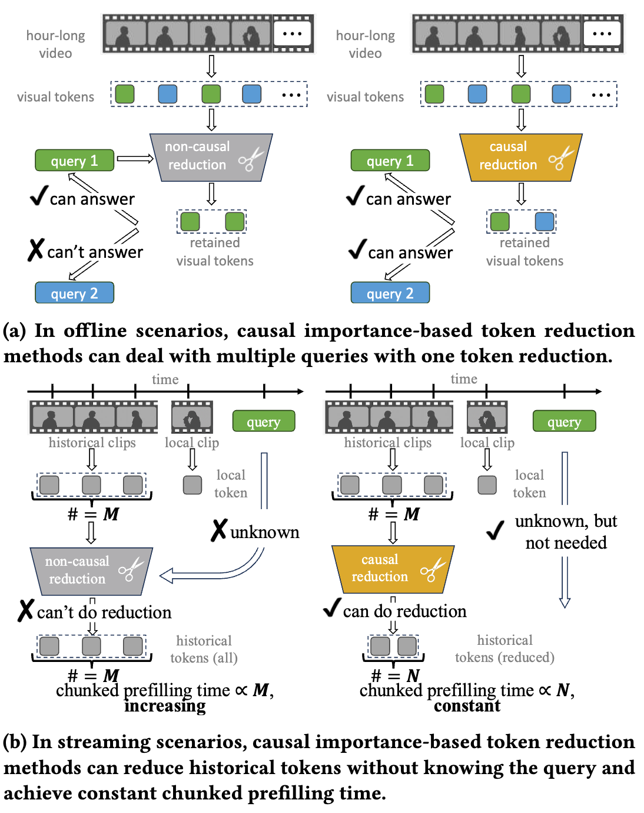

[](#License)

# CITR
Official Implementation of ACMMM 2025 paper ""

> Pytorch implementation for codes in [CITR: Efficient Long Video Understanding Needs Causal Importance (Accepted by ACM Multimedia 2025)](https://acmmm2025.org/). This work focuses on the efficiency challenge in long video understanding. We proposes the CITR framework for causal importance-based token reduction, achieving reduced latency and effective memory control with minimal performance drop in offline and streaming scenarios.

## Motivation

> Existing efficient video inference methods usually have to make use of user query information when compressing the key-value (kv) cache. Specifically, they perform attention computation on the video kv-cache by using user queries to obtain importance scores. However, these methods are not readily applicable to important scenarios such as multi-round question answering and streaming video understanding, because user queries in these cases cannot be predicted in advance.

<div align="center">

</div>


## Usage

> Below, we provide a method for training a model with Qwen2-VL-7B-Instruction as the backbone. Migrating to other backbones (e.g. videochat flash) only requires a small amount of code modification to complete

1. Ground Truth Importance Scores Supervise Finetuning Dataset Construction.
```sh
python src/data_gen \
    --model_dir <path_to_Qwen2-VL-7B-Instruct> \
    --data_path <path_to_NextQA> \
    --video_path <path_to_NEXTQA_vidoe> \
```
    
    
2. Causal Importance Estimation SFT
```sh
python src/train.py \
    --model_dir <path_to_Qwen2-VL-7B-Instruct> \
    --data_dir <path_to_SFT_data> \ 
    --checkpoint_dir <path_to_save_checkpoint>
```

3. Performance Evaluation. 

    For Performance Evaluation. Now, we provide the evaluation code for NEXTQA dataset and VideoMME dataset. Please first download the corresponding dataset from huggingface/modelscope to the `/home/yuanziqi/CITR/resources/datasets` folder.

    3.1 MultiRound QA Evaluation in NEXTQA.
    > Step one: Preprocessing the NEXTQA dataset.

    ```sh
    python src/eval/nextqa/processing_multiround.py \
        --model_dir <path_to_Qwen2-VL-7B-Instruct> \
        --data_path <path_to_NextQA> \
        --video_path <path_to_NEXTQA_vidoe>
    ```

    > Step two: Performing Inference.
    ```sh
    python src/eval/nextqa/multiround_test.py \ 
        --dataset nextqa_mc_200k_1_mt \ 
        --model_dir <path_to_save_checkpoint> \
        --log_dir ./logdir
    ```

    3.2 Evaluation on VideoMME-Long
     > Step one: Preprocessing the NEXTQA dataset.

    ```sh
    python src/eval/videomme/processing.py \
        --model_dir <path_to_Qwen2-VL-7B-Instruct> \
        --data_path <path_to_VideoMME> 
    ```

    > Step two: Performing Inference.
    ```sh
    python src/eval/videomme/multiround_test.py \ 
        --dataset videomme_mc_wo_long_200k_256_tp \ 
        --model_dir <path_to_save_checkpoint> \
        --tokenizer_dir <path_to_Qwen2-VL-7B-Instruct> \
        --log_dir ./logdir
    ```


## 🙏 Acknowledgments

The code is built upon [Locret](https://github.com/huangyuxiang03/Locret). We thank their authors for open-sourcing their great work.

